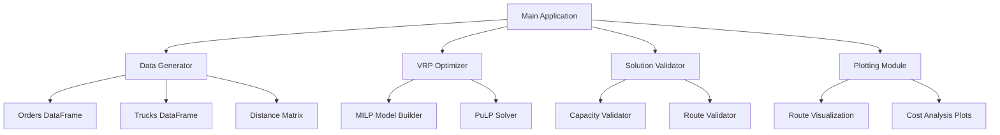

# Design Document

## Overview

The Vehicle Router system is a production-ready Python application that solves the Vehicle Routing Problem (VRP) with order assignment optimization. The system uses Mixed Integer Linear Programming (MILP) to minimize total operational costs while respecting truck capacity constraints and optimizing delivery routes.

The architecture follows clean code principles with clear separation of concerns, comprehensive logging, and extensive documentation. The system is designed to be extensible, maintainable, and suitable for production use.

## Architecture

### High-Level Architecture



### Module Structure

The system follows a modular architecture with the following layers:

1. **Data Layer**: Handles data generation and management
2. **Optimization Layer**: Implements the MILP solver
3. **Validation Layer**: Ensures solution correctness
4. **Visualization Layer**: Provides plotting and analysis
5. **Application Layer**: Orchestrates the workflow

## Components and Interfaces

### 1. DataGenerator Class

**Purpose**: Generate and manage input data for the optimization problem

**Key Methods**:
- `generate_orders() -> pd.DataFrame`: Creates order data with volume and postal codes
- `generate_trucks() -> pd.DataFrame`: Creates truck data with capacity and costs
- `generate_distance_matrix() -> pd.DataFrame`: Calculates distances between postal codes

**Interface**:
```python
class DataGenerator:
    def __init__(self, use_example_data: bool = True):
        """Initialize with option to use example or random data"""
        
    def generate_orders(self) -> pd.DataFrame:
        """Generate orders with columns: order_id, volume, postal_code"""
        
    def generate_trucks(self) -> pd.DataFrame:
        """Generate trucks with columns: truck_id, capacity, cost"""
        
    def generate_distance_matrix(self, postal_codes: List[str]) -> pd.DataFrame:
        """Generate distance matrix between postal codes"""
```

### 2. VrpOptimizer Class

**Purpose**: Implement the MILP optimization model using PuLP

**Key Methods**:
- `build_model()`: Construct decision variables and constraints
- `solve()`: Execute the optimization with logging
- `get_solution()`: Return structured results

**Interface**:
```python
class VrpOptimizer:
    def __init__(self, orders_df: pd.DataFrame, trucks_df: pd.DataFrame, distance_matrix: pd.DataFrame):
        """Initialize with problem data"""
        
    def build_model(self) -> None:
        """Build MILP model with decision variables and constraints"""
        
    def solve(self) -> bool:
        """Solve the optimization problem with detailed logging"""
        
    def get_solution(self) -> Dict[str, pd.DataFrame]:
        """Return solution as structured DataFrames"""
```

### 3. SolutionValidator Class

**Purpose**: Validate optimization results for correctness

**Key Methods**:
- `check_capacity()`: Verify capacity constraints
- `check_all_orders_delivered()`: Ensure all orders are assigned
- `check_route_feasibility()`: Validate route logic

**Interface**:
```python
class SolutionValidator:
    def __init__(self, solution: Dict, orders_df: pd.DataFrame, trucks_df: pd.DataFrame):
        """Initialize with solution and input data"""
        
    def validate_solution(self) -> Dict[str, bool]:
        """Run all validation checks and return report"""
```

### 4. Plotting Module

**Purpose**: Provide visualization capabilities for results analysis

**Key Functions**:
- `plot_routes()`: Visualize delivery routes on 2D grid
- `plot_costs()`: Show cost breakdown by truck
- `plot_utilization()`: Display capacity utilization

## Data Models

### Order Model
```python
Order = {
    'order_id': str,      # Unique identifier (A, B, C, D, E)
    'volume': float,      # Volume in m³
    'postal_code': str,   # Delivery location (08027-08031)
}
```

### Truck Model
```python
Truck = {
    'truck_id': int,      # Unique identifier (1-5)
    'capacity': float,    # Maximum capacity in m³
    'cost': float,        # Fixed cost in euros
}
```

### Solution Model
```python
Solution = {
    'assignments': pd.DataFrame,  # order_id, truck_id, assigned
    'routes': pd.DataFrame,       # truck_id, route_order, postal_code
    'costs': Dict[str, float],    # cost breakdown
    'summary': Dict[str, Any],    # optimization summary
}
```

## MILP Formulation

### Decision Variables
- `x[i,j]`: Binary variable, 1 if order i is assigned to truck j, 0 otherwise
- `y[j]`: Binary variable, 1 if truck j is used, 0 otherwise
- `z[j,k,l]`: Binary variable, 1 if truck j travels from location k to location l

### Objective Function
```
Minimize: Σ(truck_cost[j] * y[j]) + Σ(distance[k,l] * z[j,k,l])
```

### Constraints
1. **Order Assignment**: Each order assigned to exactly one truck
2. **Capacity**: Total volume per truck ≤ truck capacity
3. **Truck Usage**: If truck has orders, then truck is used
4. **Route Continuity**: Ensure valid routes for each truck

## Error Handling

### Input Validation
- Validate DataFrame schemas and data types
- Check for missing or invalid values
- Ensure positive volumes and capacities
- Validate postal code formats

### Optimization Errors
- Handle infeasible problems gracefully
- Provide meaningful error messages for solver failures
- Implement timeout handling for long-running optimizations

### Solution Validation
- Verify all constraints are satisfied
- Check for numerical precision issues
- Validate route feasibility

## Testing Strategy

### Unit Tests
- **Data Generation**: Test order and truck generation with various parameters
- **Optimization**: Test MILP model building and solving with known inputs
- **Validation**: Test constraint checking with valid and invalid solutions
- **Utilities**: Test helper functions and data transformations

### Integration Tests
- **End-to-End**: Test complete workflow from data generation to visualization
- **Example Data**: Verify system works with specified example dataset
- **Edge Cases**: Test with minimal/maximal problem sizes

### Test Data Strategy
- Use the specified example data as primary test case
- Generate additional test scenarios with varying problem sizes
- Include edge cases (single truck, single order, capacity exactly matching)

## Performance Considerations

### Optimization Performance
- Use efficient MILP formulation to minimize solver time
- Implement problem size warnings for large instances
- Consider heuristic approaches for very large problems

### Memory Management
- Use pandas efficiently for large datasets
- Implement data streaming for very large problem instances
- Clear intermediate variables after optimization

### Scalability
- Design for problems with 100+ orders and 20+ trucks
- Implement progress tracking for long-running optimizations
- Consider parallel processing for independent calculations

## Logging and Monitoring

### Logging Strategy
- Use Python logging module with INFO level as default
- Log key optimization steps and progress
- Include timing information for performance monitoring
- Log validation results and any constraint violations

### Example Log Output
```
[INFO] Starting Vehicle Router optimization...
[INFO] Generated 5 orders with total volume 150.0 m³
[INFO] Generated 5 trucks with total capacity 225.0 m³
[INFO] Building MILP model with 25 decision variables
[INFO] Adding capacity constraints for 5 trucks
[INFO] Adding order assignment constraints for 5 orders
[INFO] Starting optimization solver...
[INFO] Optimization completed in 2.3 seconds
[INFO] Solution found with total cost €3000
[INFO] Validation passed: All constraints satisfied
```

## Configuration and Extensibility

### Configuration Options
- Solver parameters (timeout, gap tolerance)
- Logging levels and output formats
- Visualization settings (colors, plot sizes)
- Data generation parameters (random seeds, ranges)

### Extension Points
- **New Algorithms**: Interface allows easy swapping of optimization engines
- **Additional Constraints**: Modular constraint building supports new requirements
- **Custom Visualizations**: Plotting module designed for easy extension
- **Data Sources**: DataGenerator can be extended for different input formats